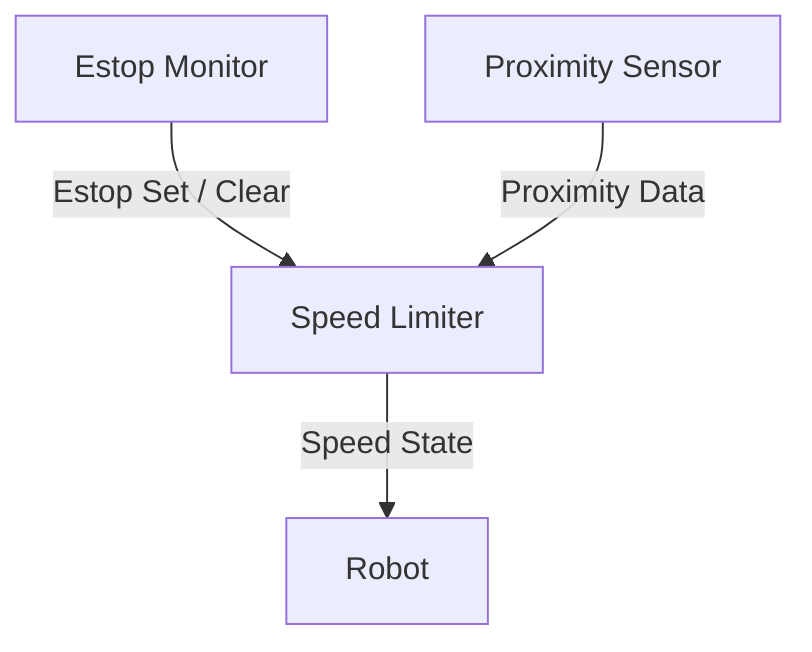

# Summary
The following diagram shows ROS nodes and messages sent between nodes within the speed limiting system.

```mermaid
flowchart TD
    Estop@{ label: "Estop Monitor" }
    Proximity@{ label: "Proximity Sensor" }
    Speed@{ label: "Speed Limiter" }
    Estop-- Estop Set / Clear -->Speed
    Proximity-- Proximity Data -->Speed
    Speed-- Speed State -->Robot
```