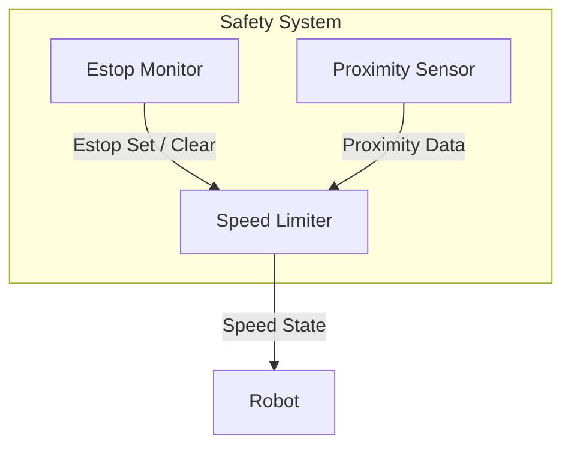

# Summary
The following diagram shows ROS nodes and messages sent between nodes within the safety system.

# Quality of Service Chosen
- The estop quality of service is set for reliable and transient local durability so that the latest estop state can be sent to late joiners and because these messages are expected to be published infrequently.
- For similar reasons, the speed state quality of service is also set to reliable and transient local durability.
- The proximity data quality of service is set for default "sensor" quality of service settings (best effort) since it is expected to be streamed periodically and frequently.